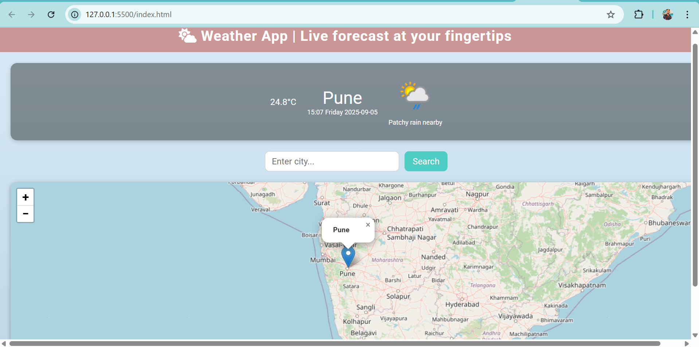

# 🌦️ Weather + Map App

A simple weather & map application built using **HTML, CSS, JavaScript and Leaflet.js**.  
It shows live location on the map with a marker and popup, along with a weather forecast section.

---

## 🚀 Features
- 🌍 Display map with location marker (powered by Leaflet + OpenStreetMap)  
- 📍 Search city and get map centered at that location  
- ☁️ Shows weather information (temperature, condition, time, location)  
- 🔍 Smooth UI with responsive design  

---

## 📸 Screenshot



---

## 🛠️ Tech Stack
- **Frontend:** HTML, CSS, JavaScript  
- **Map Library:** Leaflet.js  
- **API Used:** OpenStreetMap (tiles)  

---

## 📂 Project Structure
Weather-Map-App/
│── index.html
│── style.css
│── app.js
│── map.js
│── screenshot.png


## 🎯 How to Run  
1. Clone this repository:  
   ```bash
   git clone https://https://github.com/ashishjain135/Weather_App_With_Map
2.Open index.html in browser

📌 Future Scope
🌡️ Add real-time weather API (OpenWeatherMap)
📍 Detect user’s live location via Geolocation API
🌑 Dark mode map support


🌦️** Weather + Map App – Interview Q&A**
1. Why did you use Leaflet.js instead of Google Maps API?
 Leaflet is open-source, lightweight (~39 KB), free (no API key), and integrates well with OpenStreetMap.
Google Maps is powerful but requires billing setup & API key. For small projects, Leaflet is faster and simpler.

2. How does map.setView([lat, lon], zoom) work?
It re-centers the map at given latitude & longitude with a specified zoom level.
Example: map.setView([28.7041, 77.1025], 10) → centers map on Delhi with zoom 10.

3. What is the difference between marker.addTo(map) and L.marker([...])?
L.marker([lat, lon]) → creates a marker object.
.addTo(map) → actually displays it on the map.
So both together are needed to show markers.

4. How do you update the marker when a new location is searched?
Pehle check karte hain agar marker already hai → to .remove() kar dete hain.
Phir naye coordinates ke sath marker add karte hain.

if (marker) marker.remove();
marker = L.marker([lat, lon]).addTo(map);

5. Why did you use OpenStreetMap tiles?
OpenStreetMap is free, community-driven, and integrates seamlessly with Leaflet.
It avoids the API key/billing headache of Google Maps.

6. How would you integrate real weather data?
By using APIs like OpenWeatherMap:
fetch(`https://api.openweathermap.org/data/2.5/weather?q=${city}&appid=API_KEY`)
.then(res => res.json())
.then(data => console.log(data));
This API gives temperature, humidity, condition, etc.

7. What are some UI/UX improvements you did in CSS?
Gradient background → modern look
Rounded corners & box-shadow → clean UI
Flexbox → responsive layout
Hover effect on button → better user experience

8. How would you make the app mobile-friendly?
Use:
width: 100% for map and inputs
Media queries (@media (max-width: 600px) { ... })
Flexbox wrapping for weather info

9. What security concerns are there in this project?
User input (city name) can be vulnerable to XSS injection if directly used.
To fix: sanitize inputs before rendering.
If API keys are added → never hardcode them in frontend (use .env on server).

10. What future improvements would you suggest?
Integrate OpenWeather API for real data
Use Geolocation API to auto-detect user’s location
Add dark mode / map themes
Store recent searches in localStorage
